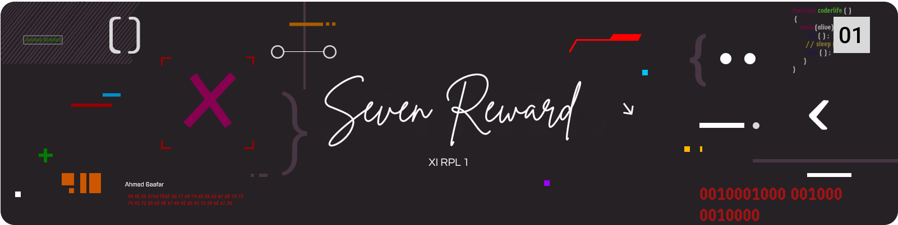

# 7rew — Seven Reward

> Koleksi halaman HTML/JS interaktif dari anggota **Kelompok 7**.  
> Satu repo, banyak gaya: retro arcade, playground fisika, mini OS, sampai majalah digital.

[🌐 Kunjungi Website](https://7rew.vercel.app/)  •  [📂 Kode Sumber](./)


---

## 🔎 Gambaran Proyek
Repositori ini berisi homepage dan 5 sub-halaman anggota:

- `index.html` — Beranda elegan dengan “Matrix rain”, glow trail mouse, kartu anggota, dan maskot lucu yang berjalan melintas.
- `Fathir/` — Art Magazine (Bright Edition): kanvas motion, night-typographic, overlay geometri, copy-to-clipboard, dan easter egg “ARTMODE”.
- `Rehan/` — Pixel Lab Arcade: game penalty mini (canvas) dengan CRT vibes, combo, HUD, D-pad on-screen, WebAudio SFX, dan kode rahasia (Konami, “insert coin”, ghost ball).
- `Riki/` — Code & Ball Playground: simulasi fisika dengan slider kontrol, target practice, screenshot-to-sticker, drag & drop texture, moon gravity, dan panel lanjutan (Konami).
- `Rustaman/` — Mini OS Potret: lock screen fingerprint, widget jam/cuaca/baterai/langkah, app kalkulator/notes/timer/settings/gallery/music/weather/calendar, wallpaper 1.jpg–20.jpg & musik track1.mp3 otomatis.
- `Salman/` — Neon Anime Stadium Game: bola neon, partikel, goal box, fisika sederhana, dan efek glow.

Semua halaman dibuat dengan HTML + CSS + JavaScript murni (tanpa framework). Tidak ada proses build.

---

## ✨ Fitur Utama
- UI modern dan performa ringan (single rAF loop di banyak halaman).
- Interaksi kanvas (canvas) untuk animasi, permainan, atau simulasi.
- Aksesibilitas dasar: fokus keyboard, ARIA untuk tab/modal/toolbar.
- Banyak “hidden gems”: Konami code, mode rahasia, gesture, dll.

---

## 🗂️ Struktur Folder

```
7rew-main/
├─ index.html                # Homepage anggota + efek latar
├─ Fathir/
│  └─ index.html             # Art Magazine (Bright)
├─ Rehan/
│  └─ index.html             # Pixel Lab Arcade
├─ Riki/
│  └─ index.html             # Code & Ball Playground
├─ Rustaman/
│  ├─ index.html             # Mini OS Potret
│  ├─ 1.jpg ... 7.jpg        # Sample wallpaper untuk gallery/wallpaper
│  └─ track1.mp3             # Sample musik (opsional: track2.mp3, ...)
├─ Salman/
│  └─ index.html             # Neon Stadium mini-game
└─ shots/
	 ├─ ss (1).png ... ss (6).png  # Screenshot pratinjau
```

---

## 🖼️ Galeri Screenshot

<table>
<tr>
	<td></td>
	<td></td>
	<td></td>
</tr>
<tr>
	<td></td>
	<td></td>
	<td></td>
</tr>
  <tr>
  <td></td>
  <td></td>
  <td></td>
  </tr>
</table>

Catatan: File pada folder `shots/` mengandung spasi dan tanda kurung; tautan di atas sudah di-URL-encode agar tampil di Markdown.

---

## ▶️ Cara Menjalankan

Pilihan cepat:
- Buka `index.html` langsung (double-click) untuk menjelajah secara lokal.
- Atau pakai server lokal supaya path relatif/asset bekerja konsisten.

Opsional (PowerShell, jika Python terpasang):

```powershell
python -m http.server 5173
Start-Process http://localhost:5173/
```

Atau gunakan ekstensi “Live Server” di VS Code dan jalankan pada root proyek.

---

## 🔗 Halaman Anggota (local HTML)
- Beranda: `index.html`
- Fathir: `Fathir/index.html`
- Rehan: `Rehan/index.html`
- Riki: `Riki/index.html`
- Rustaman: `Rustaman/index.html`
- Salman: `Salman/index.html`

Tips: Beberapa halaman memuat asset lokal (mis. `1.jpg`, `track1.mp3`). Letakkan file sesuai instruksi pada halaman untuk pengalaman penuh.

---

## 👥 Kontributor (peran singkat)
- Fathir — Front-end & editorial UI
- Rehan — Game/Arcade & WebAudio
- Riki — Physics playground & tooling
- Rustaman — Mini OS, widget & apps
- Salman — Canvas mini-game neon

---

## 📄 Lisensi
Lihat berkas [LICENSE](LICENSE).

